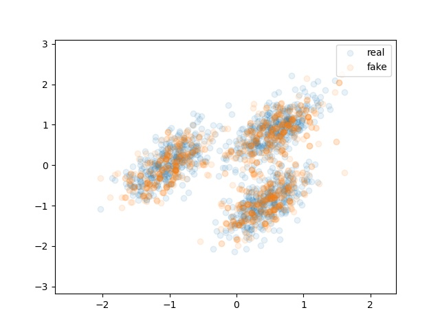
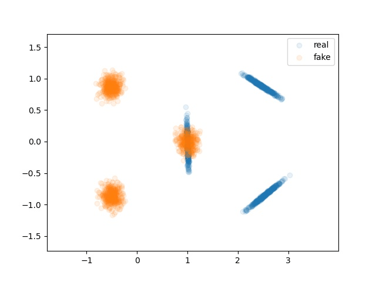
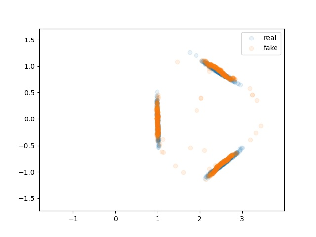
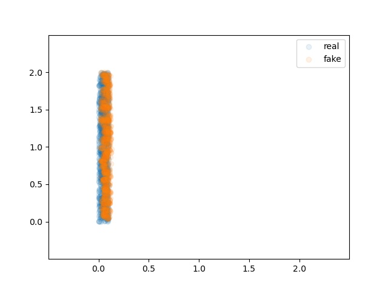

# Trust-the-Critics
This repository is a PyTorch implementation of the TTC algorithm for 2-D toy examples. This code can be used to apply TTC to a variety of 2-D
source and target distributions. Unlike the main code, this will not save the trained critics; instead, figures are generated
after each critic is trained to visualize the progress of the source distribution mu as it moves towards the target nu.

## Toy Examples
The following figure shows TTC applied to several toy examples. The left column shows the initial distributions of mu (fake) and nu (real), the right column shows the final distributions after 60 steps of TTC, and the middle column is a gif showing the evolution of the source data over the steps of TTC. These figures can be generated by running ttc_2d.py with the args as specified by the train_config.txt files within the figs folder.

  
  
  
  
  
  

Each figure was created using 60 steps of TTC, as well as a minimum step size of 0.05. To see how the generated data moves, we have plotted here the evolution of a fixed batch of data from the source distribution under the steps of TTC; the critics themselves are trained on the entire source and target distribution however.

Note that due to the flexibility of TTC it is able to generate target data with multiple connected components given source data with a single connected component. Such behaviour is impossible with a standard GAN, which, due to the continuity of the generator, always generates a distribution with as many connected components as its latent distribution.

## How to run this code ##
* Create a Python virtual environment with Python 3.8 installed.
* Install the necessary Python packages listed in the requirements.txt file (this can be done through pip install -r /path/to/requirements.txt).

### TTC algorithm
  
Necessary arguments for ttc_2D.py are:
* 'source' : The name of the distribution or dataset that is to be pushed towards the target (options are listed in ttc_2d.py, with details in dataloader_2D.py).
* 'target' : The name of the target dataset (options are listed in ttc_2D.py, with details in dataloader_2D.py).
* 'temp_dir' : The path of a directory where figures summarizing the training process will be saved, along with a few other files (including the log.pkl file that contains the step sizes). Despite the name, this folder isn't necessarily temporary.

Other optional arguments are described in a commented section at the top of the ttc_2D.py script.

